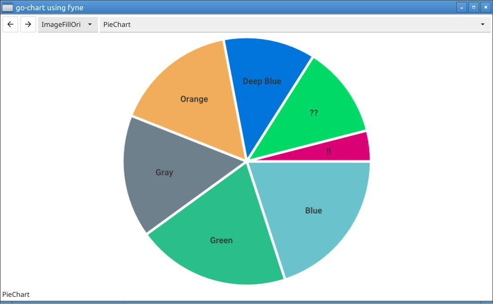

# go-chart_fyne
go-chart using fyne  

  
## some screen capture  
  
### PieChart on win10
  

### PieChart on LUbuntu21.10 amd64
    

### StockAnalysis on win10
    

  
### StackedBar on win10  
   
  
### Annotation on win10 
   
  
### BenchmarkLine on win10  
   
  
### LinearRegression on win10  
    

### BarChart on win10  
   