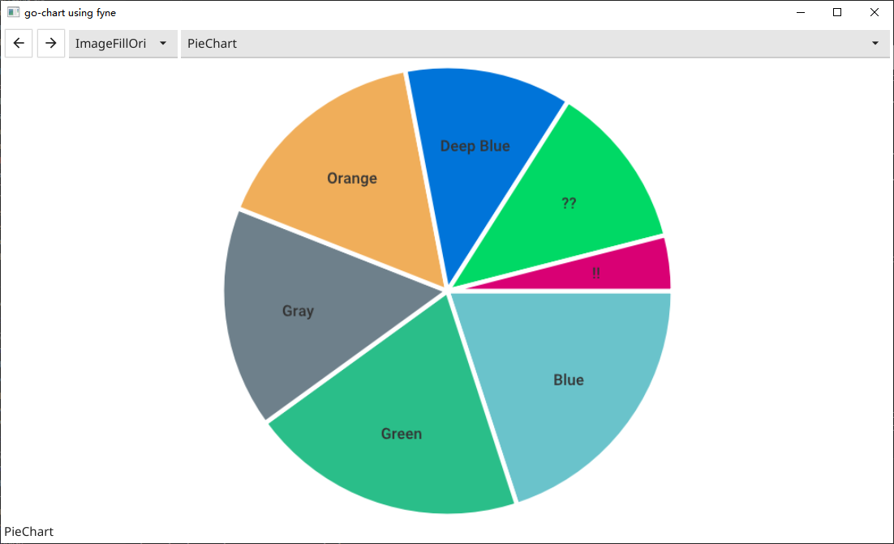
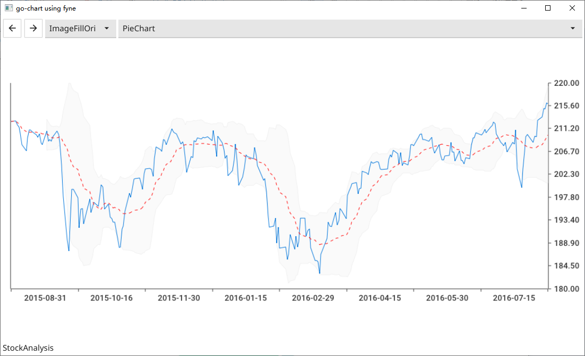
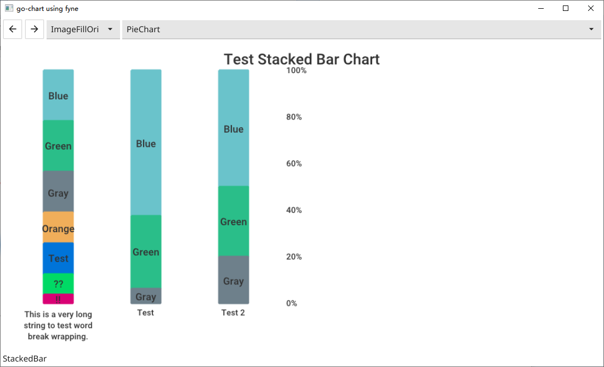
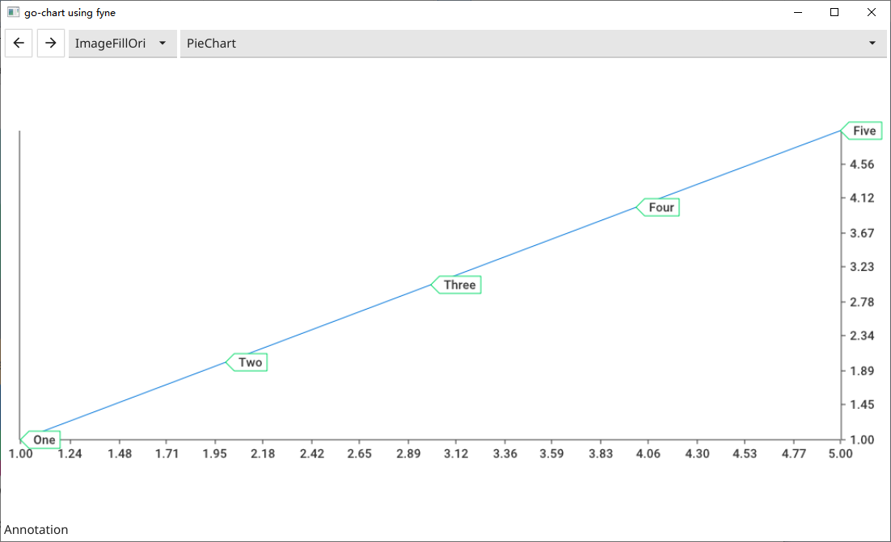
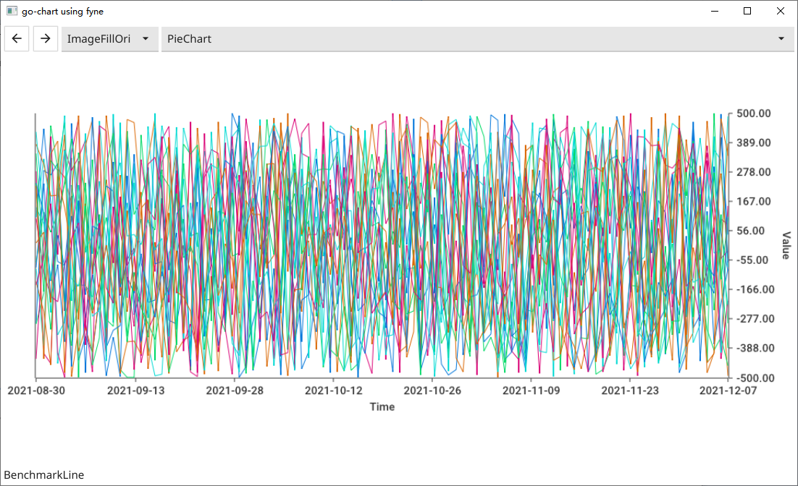
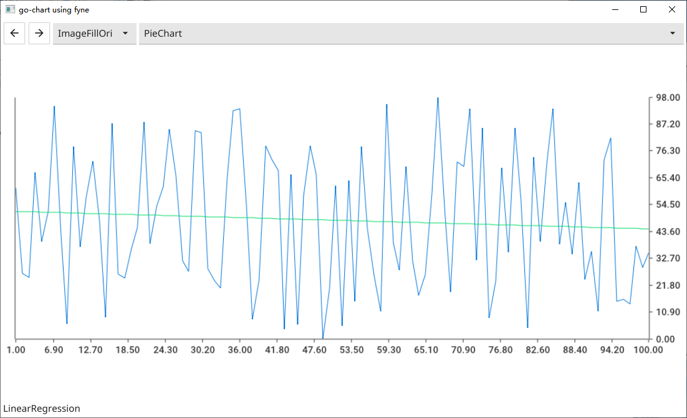
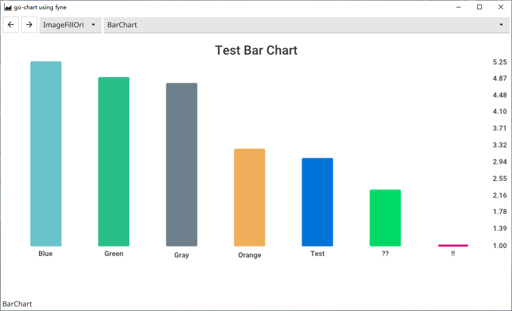

# go-chart_fyne
go-chart using fyne  

  
## some screen capture  
  
### PieChart  
  
  
### StockAnalysis  
    

  
### StackedBar  
   
  
### Annotation  
   
  
### BenchmarkLine  
   
  
### LinearRegression  
    

### BarChart  
   